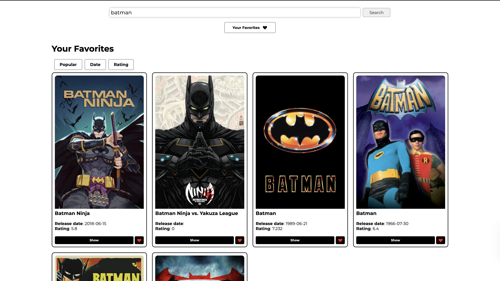

# Interactive Web Applications Project

This project consists of three interactive web applications: a Movies App, a Recipe App, and a Weather App. Each application demonstrates essential functionalities, such as fetching data from APIs, providing a responsive search with auto-suggestions, and utilizing local storage to retain user preferences.

---

## 1. Movies App

### Overview
The Movies App enables users to search for movies, view details about each movie, and save favorites to a watchlist. It uses The Movie Database (TMDb) API to retrieve movie data based on user input.

### Key Features
- **Search Movies**: Enter a movie title to search, with auto-suggestions for related titles.
- **Movie Details**: Click on a movie to view information, including release date, rating, and cast.
- **Watchlist**: Save favorite movies to a watchlist that persists through local storage, even after reloading the page.

### Instructions to Run
1. Replace `YOUR_API_KEY` in `movies.js` with your TMDb API key.
2. Open `movies.html` in a web browser.
3. Start searching for movies, view details, and add favorites to your watchlist.

### Screenshots
  
  
  

---

## 2. Recipe App

### Overview
The Recipe App allows users to search for recipes by ingredients or dish name, view full recipe details, and save favorite recipes. It utilizes the Spoonacular API to display recipes with ingredients, instructions, and nutritional information.

### Key Features
- **Recipe Search**: Search recipes with auto-suggestions based on popular dishes.
- **Recipe Details**: View full details for each recipe, including ingredients, instructions, and nutrition.
- **Favorites List**: Add recipes to a favorites list that is stored in local storage for easy access.

### Instructions to Run
1. Replace `YOUR_API_KEY` in `recipe.js` with your Spoonacular API key.
2. Open `recipe.html` in a web browser.
3. Use the search bar to find recipes and add favorites.

### Screenshots
- **Recipe Suggestions**:
  
  
- 

---

## 3. Weather App

### Overview
The Weather App provides real-time weather information and a 5-day forecast for a selected city or the user’s current location. It uses the OpenWeatherMap API to retrieve weather data based on city input or geolocation.

### Key Features
- **City-Based Search**: Enter a city name to view weather information, with suggestions as you type.
- **Current Weather & Forecast**: Displays temperature, humidity, wind speed, and a 5-day forecast.
- **Location-Based Weather**: Access weather data based on the user's location if geolocation is enabled.
- **Temperature Unit Toggle**: Switch between Celsius and Fahrenheit.

### Instructions to Run
1. Replace `YOUR_API_KEY` in `weather.js` with your OpenWeatherMap API key.
2. Open `weather.html` in a web browser.
3. Search for a city's weather or click the location button to get data based on your location.

### Screenshots
- **City Suggestions**:
  
  
  

---

## General Setup Instructions

1. **Download or Clone the Repository**: Clone this repository or download the files for each app.
2. **Add API Keys**: Obtain API keys for TMDb, Spoonacular, and OpenWeatherMap, then update the `movies.js`, `recipe.js`, and `weather.js` files accordingly.
3. **Open in Browser**: Run each application by opening the `movies.html`, `recipe.html`, or `weather.html` files in your browser.

With these steps, you’ll be able to explore the full functionality of each web application.
